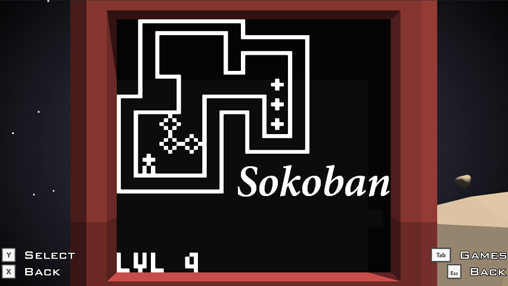

# Sokoban
[Sokoban](https://en.wikipedia.org/wiki/Sokoban) arcade game for Redirection.

## Sokoban
Sokoban is a puzzle game (1982) in which the player pushes crates or boxes around in a warehouse, trying to get them to storage locations.

## Redirection robot arcade
Robot comprises 64×64 B/W screen, 4 directional joystick and two buttons. Arcade are programmed in Lua. In game the screen my look something like this
  
In this arcade, there are 30 levels ready to be played. (They are saved in text files - you can replace them if you want to).
If you are interested, check it on [Steam workshop](https://steamcommunity.com/sharedfiles/filedetails/?id=1494101674).